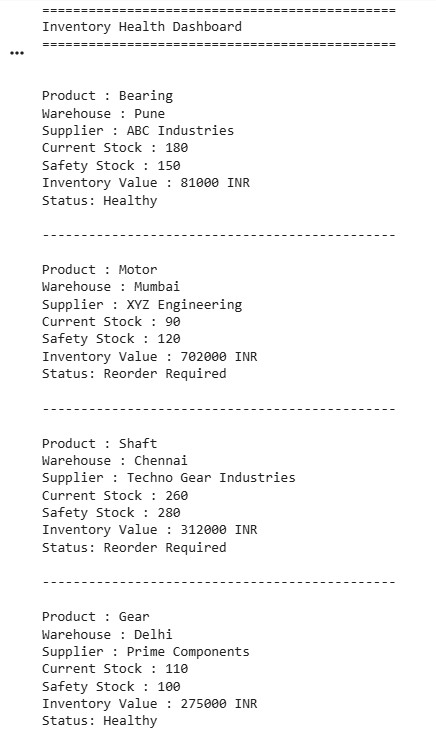
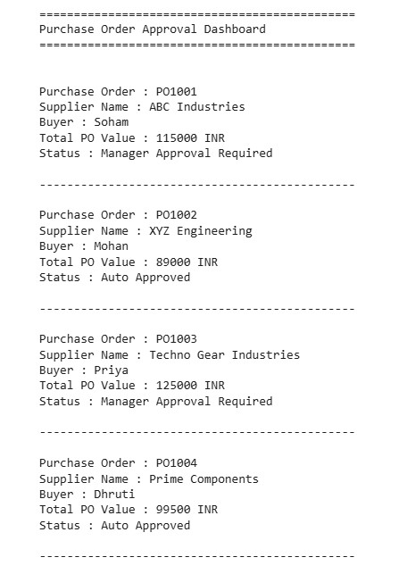

# Week 1 – Python Fundamentals for Supply Chain Analytics

## Objective
Learn Python fundamentals by applying them to practical Supply Chain Management scenarios.

## Topics Covered
- Variables
- Lists
- List indexing
- f-strings
- Print formatting
- Comparison operators
- if-else statements

## SCM Exercises

### 1. Inventory Health Dashboard
Compared current inventory against safety stock to identify whether inventory is healthy or requires replenishment.

[View Notebook](04_Inventory_Health_Dashboard.ipynb)

### 2. Purchase Order Approval Dashboard
Applied approval logic based on purchase order value and an approval threshold.

[View Notebook](05_Purchase_Order_Approval_Dashboard.ipynb)

### 3. Customer Order Fulfillment Dashboard
Compared available inventory against customer order quantity to determine whether an order is ready for dispatch.

[View Notebook](06_Customer_Order_Fulfillment_Dashboard.ipynb)

## Key Learning
The focus was not only on Python syntax, but on converting Supply Chain business rules into program logic.

## Next Week
The next stage will focus on `for` loops and using them to automate repetitive SCM reporting tasks.
